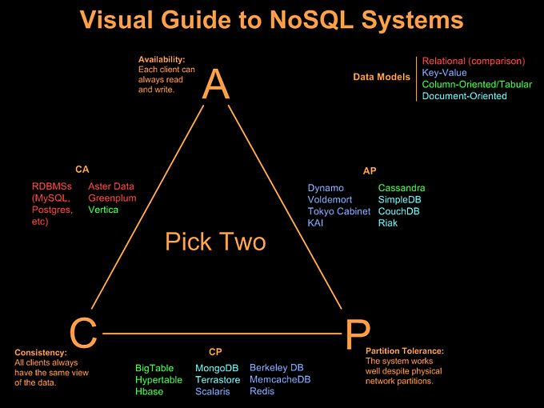
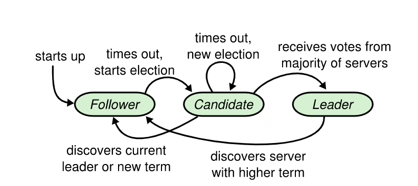
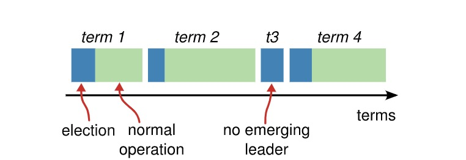
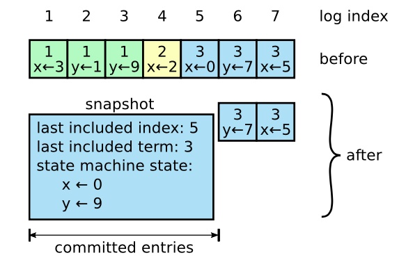
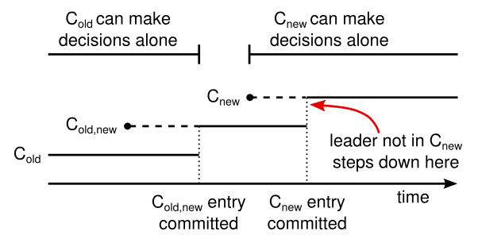
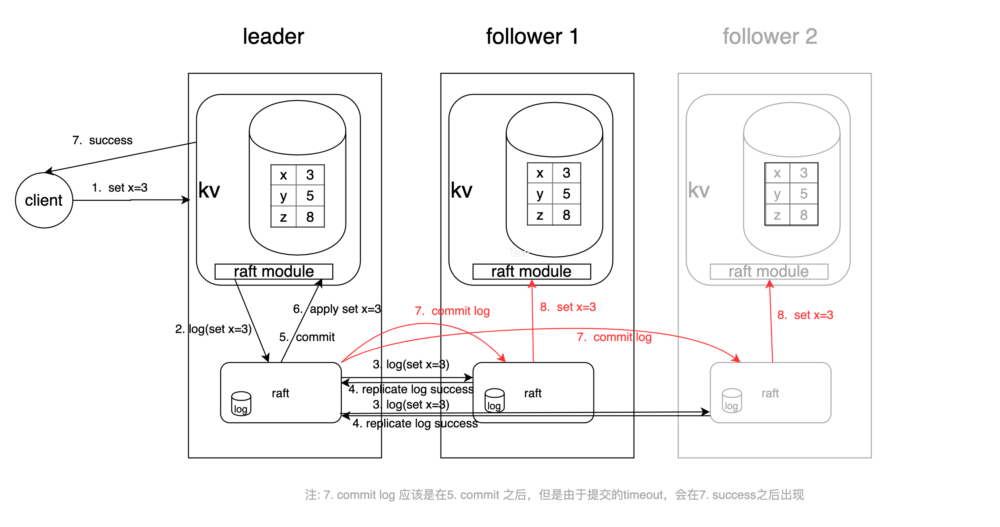
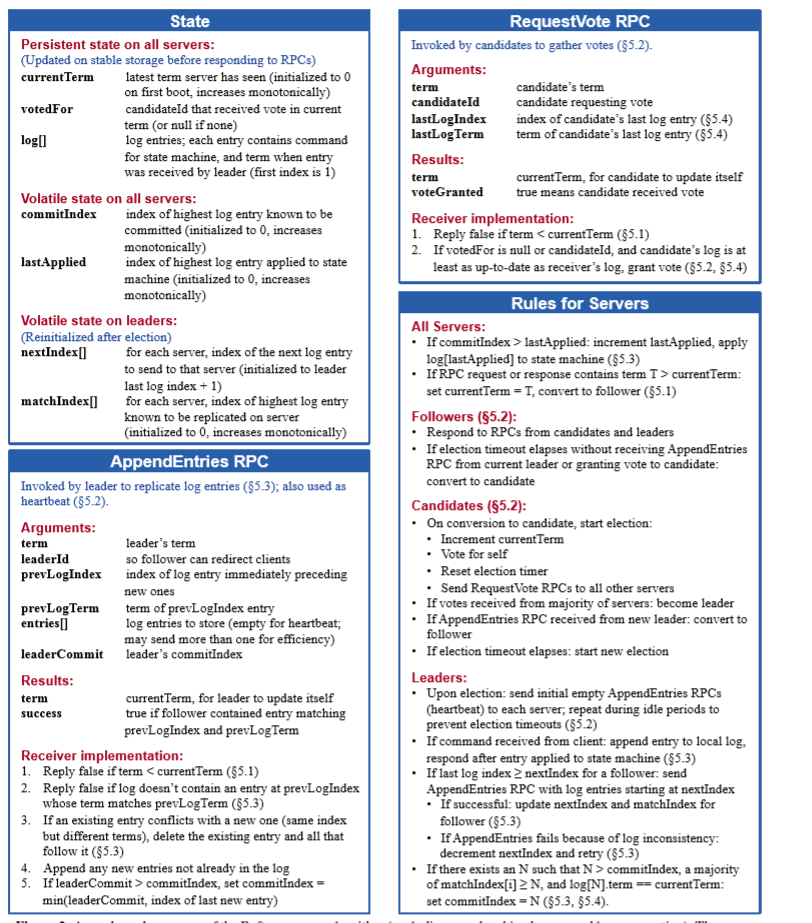

### 分布式系统

    * 分布式（Distributed）是指在多台不同的服务器中部署不同的服务模块，通过远程调用协同工作，对外提供服务。
    > A distributed system is one in which the failure of a computer you didn’t even know existed can render your own computer unusable.
            > -- Leslie Lamport

### CAP定理(布鲁尔定理)

    * 对于一个分布式计算系统来说，不可能同时满足以下三点:
    * 1:一致性（Consistency） （等同于所有节点访问同一份最新的数据副本)
    * 2:可用性（Availability）（每次请求都能获取到非错的响应）
    * 3:分区容错性（Partition tolerance)

### CAP 模型实践

    ## CA 模型

* CA 模型即保证了可用性与强一致性，牺牲了分区容忍性。比如 MySQL Cluster 集群，提供两阶段提交事务方式，保证各节点数据强一致性。MySQL 的集群无法忍受脱离集群独立工作，一旦和集群脱离了心跳，节点出问题，导致分布式事务操作到那个节点后，整个就会失败，这是分区容忍性的牺牲。

## AP模型

* AP 模型牺牲了一致性

## CP 模型

* CP 模型即选择了强一致性与分区容忍性，牺牲了可用性。假设系统中存在节点 Node1 与 Node2，因为 Node1 节点和 Node2 节点连接中断导致分区现象，Node1 节点的数据已经更新到 y，但是 Node1 和 Node2 之间的复制通道中断，数据 y 无法同步到 Node2，Node2 节点上的数据还是旧数据 x。这时客户端 C 访问 Node2 时，Node2 需要返回 error，提示客户端系统现在发生了错误，这种处理方式违背了可用性的要求

### 一致性模型(而分布式 势必会引入一致性的问题)

* 弱(最终)一致性(Gossip)
* 强一致性(Raft Paxos)

### raft 场景

* 服务发现与注册
* 数据存储(TiDB/TiKV )
* 集群调度(HashiCorp Nomad)
* 分布式锁
* 配置 集中管理

### Raft协议

    ## 1: 介绍

* Raft (是一种用于替代Paxos的共识算法)
  * Raft 比 Paxos 算法更加容易理解
  * 安全性更高
  * 使用一种更强的领导能力形式。比如，日志条目只从领导者发送给其他的服务器
  * Raft能为在计算机集群之间部署有限状态机提供一种通用方法，并确保集群内的任意节点在某种状态转换上保持一致
  * 开源实现众多

* raft 的理论基础是 复制状态机概念，复制状态机是状态机或集群系统如果初始状态一致，然后接受的改变状态的命令也一致，最后产生的结果状态也是相同。而 达到此目通常都是基于复制日志实现的(raft 协议就是干这个的)
* 保证复制日志相同就是一致性算法的工作了。在一台服务器上，一致性模块接收客户端发送来的指令然后增加到自己的日志中去。它和其他服务器上的一致性模块进行通信来保证每一个服务器上的日志最终都以相同的顺序包含相同的请求，尽管有些服务器会宕机。一旦指令被正确的复制，每一个服务器的状态机按照日志顺序处理他们，然后输出结果被返回给客户端。因此，服务器集群看起来形成一个高可靠的状态机

## 2: 选举过程

* Raft 算法成立的前提条件基本假设：
  * （１）分布式系统是异步的，例如，消息传递的延迟时间没有上界或者执行计算的时间也没有限制．我们不能假设此分布式系统是时钟同步的．
  * （２）集群中节点间的网络通信是不可靠的，包括网络延迟、数据包丢失等情况．
  * （３）不能发生拜占庭错误．(伪造信息恶意相应或错误响应)
  * （４）客户端只能和集群中的 Leader节点交互(对于只读操作上层逻辑可以自己考量是否有返回脏数据的风险做取舍)
  * （５）集群中的每一个节点都有一个单调递增的任期（term）
  * （６）运行在每一个节点上的状态机初始状态都相同
  * （8）每个日志条目 有 uncommitted committed 状态
  * （9）多数原则(选举 日志复制)

* Raft 中 节点的状态分为:
  * Leader(领导人)：接收Client的请求，并进行复制，任何时刻只有一个Leader
  * Follower(跟随者)：被动接收各种RPC请求
  * Candidate(候选人)：用于选举出一个新的Leader
  * Follower长时间没有接受到心跳就会转为Candidate状态，收到多数投票应答之后可以转为Leader，Leader会定期向其他节点发送心跳 当Leader和Candidate接收到更高版本的消息后，转为Follower

* 选举过程图1（单个节点视角）

    * 选举过程图2（整体视角）

* 时间被分为很多连续的随机长度的term，term有唯一的id。每个term一开始就进行选主
  * 自己被选成了主。当收到了majority的投票后，状态切成Leader，并且定期给其它的所有server发心跳消息（不带log的AppendEntriesRPC）以告诉对方自己是current_term_id所标识的term的leader。每个term最多只有一个leader，term id作为logical clock，在每个RPC消息中都会带上，用于检测过期的消息。当一个server收到的RPC消息中的rpc_term_id比本地的current_term_id更大时，就更新current_term_id为rpc_term_id，并且如果当前state为leader或者candidate时，将自己的状态切成follower。如果rpc_term_id比本地的current_term_id更小，则拒绝这个RPC消息。
    * 别人成为了主。如1所述，当Candidator在等待投票的过程中，收到了大于或者等于本地的current_term_id的声明对方是leader的AppendEntriesRPC时，则将自己的state切成follower，并且更新本地的current_term_id。
    * 没有选出主。当投票被瓜分，没有任何一个candidate收到了majority的vote时，没有leader被选出。这种情况下，每个candidate等待的投票的过程就超时了，接着candidates都会将本地的current_term_id再加1，发起RequestVoteRPC进行新一轮的leader election。

* 投票策略:
  * 每个节点只会给每个term投一票，具体的是否同意和后续的Safety有关。
    * 当投票被瓜分后，所有的candidate同时超时，然后有可能进入新一轮的票数被瓜分，为了避免这个问题，Raft采用一种很简单的方法：每个Candidate的election timeout从150ms-300ms之间随机取，那么第一个超时的Candidate就可以发起新一轮的leader election，带着最大的term_id给其它所有server发送RequestVoteRPC消息，从而自己成为leader，然后给他们发送心跳消息以告诉他们自己是主。

### 日志复制流程

* 日志格式：term + index + cmd + type

* 当Leader被选出来后，就可以接受客户端发来的请求了，每个请求包含一条需要被replicated state machines执行的命令。leader会把它作为一个log entry append到日志中，然后给其它的server发AppendEntriesRPC请求。当Leader确定一个log entry被safely replicated了（大多数副本已经将该命令写入日志当中），就apply这条log entry到状态机中然后返回结果给客户端。如果某个Follower宕机了或者运行的很慢，或者网络丢包了，则会一直给这个Follower发AppendEntriesRPC直到日志一致。
* 当一条日志是commited时，Leader才可以将它应用到状态机中。Raft保证一条commited的log entry已经持久化了并且会被所有的节点执行。

### 日志压缩

* 更新通过Leader写入Log，复制到多数节点，变为Committed，再提交业务状态机。在实际系统中，当这个流程长时间跑的时候，Log就会无限制增长，导致Log占用太多的磁盘空间，需要更长的启动时间来加载。如果不采取一些措施进行Log Compaction最终将会导致系统不可用

* Snapshot 是Log Compaction的常用方法，将系统的全部状态写入一个Snapshot中，并持久化的一个可靠存储系统中，完成Snapshot之后这个点之前的Log就可以被删除了
* Snapshot 大概实现思路就是 保存数据元信息
    *last included index：做Snapshot的时候最后apply的log entry的index
    *last included term：做Snapshot的时候最后apply的log entry的term
    *last included configuration：做Snapshot的时候最后的Configuration
* Snapshot会花费比较长的时间，如果期望Snapshot不影响正常的Log Entry同步，需要采用Copy-On-Write的技术来实现。例如，底层的数据结构或者是存储支持COW，LSM-Tree类型的数据结构和KV库一般都支持Snapshot；或者是使用系统的COW支持，Linux的fork 等

    * 一个服务器用新的快照替换了从 1 到 5 的条目，快照值存储了当前的状态。快照中包含了最后的索引位置和任期号

### 集群成员变化

    * 分布式系统运行过程中节点总是会存在故障报修，需要支持节点的动态增删。节点增删过程不能影响当前数据的复制，并能够自动对新节点进行数据修复，如果删除节点涉及Leader，还需要触发自动选主 直接增加节点可能会导致出现新老节点结合出现两个多数集合，造成冲突.
    * 直接从一种配置转到新的配置是十分不安全的，因为各个机器可能在任何的时候进行转换。下图例子中，集群配额从 3 台机器变成了 5 台。
    * 不幸的是，存在这样的一个时间点，两个不同的领导人在同一个任期里都可以被选举成功。一个是通过旧的配置，一个通过新的配置

    *为了保证不存在 C-new 和 C-old 可以同时做出决定的时间点 可采用的办法

    * (1)有些系统在第一阶段停掉旧的配置(集群此时就不能处理客户端请求)；然后在第二阶段在启用新的配置
    * (2)每次只允许增加或删除一个成员，Cold与Cnew不可能形成两个不相交的多数派 可以从旧成员组直接切到新成员组
    * (3)配置使用两阶段方法

      * 被选出来的新领导人 C-old 配置也可能是 C-old,new 配置。在任何情况下， C-new 配置在这一时期都不会单方面的做出决定

<!-- * 请求处理详细流程 -->
<!--  -->

### Raft协议动画演示

* Raft系统运行可视化1

  * 英文 [http://thesecretlivesofdata.com/raft](http://thesecretlivesofdata.com/raft/)

  * 中文 [http://www.kailing.pub/raft/index.html](http://www.kailing.pub/raft/index.html)

* Raft系统运行可视化2 [https://raft.github.io/#implementations](https://raft.github.io/#implementations)

### hashicorp/raft

    *  [hashicorp/raft库](https://github.com/hashicorp/raft)

### 运行hashicorp/raft库搭建的简单kv服务

* 编译：go build -mod vendor

* 启动node1: ./raft-demo --http_addr=127.0.0.1:7001 --raft_addr=127.0.0.1:7000 --raft_id=1 --raft_cluster=1/127.0.0.1:7000,2/127.0.0.1:8000,3/127.0.0.1:9000

* 启动node2: ./raft-demo --http_addr=127.0.0.1:8001 --raft_addr=127.0.0.1:8000 --raft_id=2 --raft_cluster=1/127.0.0.1:7000,2/127.0.0.1:8000,3/127.0.0.1:9000

* 启动node3: ./raft-demo --http_addr=127.0.0.1:9001 --raft_addr=127.0.0.1:9000 --raft_id=3 --raft_cluster=1/127.0.0.1:7000,2/127.0.0.1:8000,3/127.0.0.1:9000

* set请求：curl http://127.0.0.1:7001/set?key=test_key&value=test_value

* get请求：curl http://127.0.0.1:7001/get?key=test_key

### skynet 的 etcd driver

* [skynet-etcd](https://github.com/cloudfreexiao/skynet-etcd)
